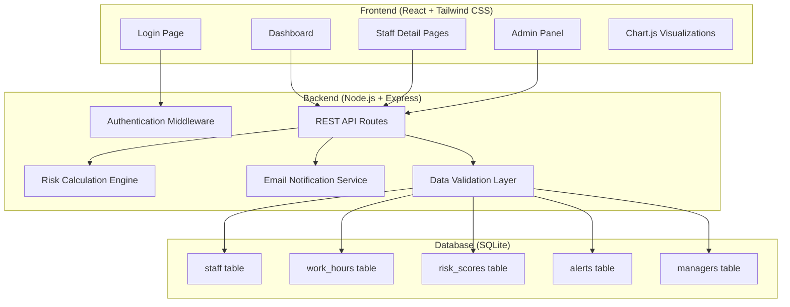

# Design Document

## Overview

The Healthcare Worker Burnout Prevention Platform is a full-stack web application built with React frontend, Node.js/Express backend, SQLite database, and Chart.js for data visualization. The system follows a RESTful API architecture with JWT-based authentication, automated risk calculation engine, and email notification service.

## Architecture

### System Architecture



### Technology Stack

- **Frontend**: React 18 with functional components and hooks
- **Styling**: Tailwind CSS for responsive design
- **Charts**: Chart.js with react-chartjs-2 wrapper
- **Backend**: Node.js with Express.js framework
- **Database**: SQLite with better-sqlite3 driver
- **Authentication**: JWT tokens with bcrypt for password hashing
- **Email**: Nodemailer for SMTP email notifications
- **API**: RESTful endpoints with JSON responses

## Components and Interfaces

### Frontend Components

#### Authentication Components
- **LoginForm**: Handles manager login with email/password
- **ProtectedRoute**: HOC for route protection and authentication checks

#### Dashboard Components
- **DashboardOverview**: Main dashboard with risk summary
- **RiskDistributionChart**: Pie/donut chart showing risk level distribution
- **TopRiskStaff**: List component showing highest-risk staff members
- **AlertNotifications**: Real-time alert display component

#### Staff Management Components
- **StaffList**: Paginated list of all staff members
- **StaffCard**: Individual staff summary card with quick actions
- **StaffDetailView**: Comprehensive staff profile page
- **WorkHourEntry**: Form for entering daily work hours
- **RiskBreakdown**: Component showing detailed risk factor analysis

#### Chart Components
- **RiskTrendChart**: Line chart showing risk score over time
- **WorkHourChart**: Bar chart displaying daily/weekly work patterns
- **DepartmentRiskChart**: Comparison chart across departments

#### Admin Components
- **AddStaffForm**: Form for creating new staff records
- **StaffManagement**: CRUD operations for staff data
- **SystemSettings**: Configuration panel for risk thresholds

### Backend API Endpoints

#### Authentication Endpoints
```
POST /api/auth/login
- Body: { email, password }
- Response: { token, manager: { id, name, email } }

POST /api/auth/logout
- Headers: Authorization: Bearer <token>
- Response: { message: "Logged out successfully" }

GET /api/auth/verify
- Headers: Authorization: Bearer <token>
- Response: { valid: boolean, manager: object }
```

#### Staff Management Endpoints
```
GET /api/staff
- Headers: Authorization: Bearer <token>
- Query: ?department=<dept>&page=<num>&limit=<num>
- Response: { staff: [], pagination: {} }

GET /api/staff/:id
- Headers: Authorization: Bearer <token>
- Response: { staff: object, riskHistory: [], workHours: [] }

POST /api/staff
- Headers: Authorization: Bearer <token>
- Body: { name, email, department, role, hire_date }
- Response: { staff: object }

PUT /api/staff/:id
- Headers: Authorization: Bearer <token>
- Body: { name, email, department, role }
- Response: { staff: object }

DELETE /api/staff/:id
- Headers: Authorization: Bearer <token>
- Response: { message: "Staff deleted successfully" }
```

#### Work Hours Endpoints
```
POST /api/work-hours
- Headers: Authorization: Bearer <token>
- Body: { staff_id, date, hours_worked, overtime_hours }
- Response: { workHour: object, updatedRiskScore: number }

GET /api/work-hours/:staff_id
- Headers: Authorization: Bearer <token>
- Query: ?start_date=<date>&end_date=<date>
- Response: { workHours: [] }

PUT /api/work-hours/:id
- Headers: Authorization: Bearer <token>
- Body: { hours_worked, overtime_hours }
- Response: { workHour: object, updatedRiskScore: number }
```

#### Risk and Analytics Endpoints
```
GET /api/dashboard/overview
- Headers: Authorization: Bearer <token>
- Response: { 
    totalStaff: number,
    riskDistribution: { low: number, medium: number, high: number },
    topRiskStaff: [],
    activeAlerts: []
  }

GET /api/risk-scores/:staff_id
- Headers: Authorization: Bearer <token>
- Query: ?days=<number>
- Response: { riskScores: [] }

GET /api/alerts
- Headers: Authorization: Bearer <token>
- Query: ?resolved=<boolean>&page=<num>
- Response: { alerts: [], pagination: {} }

PUT /api/alerts/:id/resolve
- Headers: Authorization: Bearer <token>
- Response: { alert: object }
```

## Data Models

### Database Schema

#### managers table
```sql
CREATE TABLE managers (
    id INTEGER PRIMARY KEY AUTOINCREMENT,
    name TEXT NOT NULL,
    email TEXT UNIQUE NOT NULL,
    password_hash TEXT NOT NULL,
    created_at DATETIME DEFAULT CURRENT_TIMESTAMP
);
```

#### staff table
```sql
CREATE TABLE staff (
    id INTEGER PRIMARY KEY AUTOINCREMENT,
    name TEXT NOT NULL,
    email TEXT UNIQUE NOT NULL,
    department TEXT NOT NULL CHECK (department IN ('ICU', 'Emergency', 'General')),
    role TEXT NOT NULL,
    hire_date DATE NOT NULL,
    created_at DATETIME DEFAULT CURRENT_TIMESTAMP,
    updated_at DATETIME DEFAULT CURRENT_TIMESTAMP
);
```

#### work_hours table
```sql
CREATE TABLE work_hours (
    id INTEGER PRIMARY KEY AUTOINCREMENT,
    staff_id INTEGER NOT NULL,
    date DATE NOT NULL,
    hours_worked DECIMAL(4,2) NOT NULL CHECK (hours_worked >= 0 AND hours_worked <= 24),
    overtime_hours DECIMAL(4,2) DEFAULT 0 CHECK (overtime_hours >= 0),
    created_at DATETIME DEFAULT CURRENT_TIMESTAMP,
    FOREIGN KEY (staff_id) REFERENCES staff(id) ON DELETE CASCADE,
    UNIQUE(staff_id, date)
);
```

#### risk_scores table
```sql
CREATE TABLE risk_scores (
    id INTEGER PRIMARY KEY AUTOINCREMENT,
    staff_id INTEGER NOT NULL,
    date DATE NOT NULL,
    score INTEGER NOT NULL CHECK (score >= 0 AND score <= 100),
    risk_level TEXT NOT NULL CHECK (risk_level IN ('Low', 'Medium', 'High')),
    factors JSON, -- Store breakdown of risk factors
    created_at DATETIME DEFAULT CURRENT_TIMESTAMP,
    FOREIGN KEY (staff_id) REFERENCES staff(id) ON DELETE CASCADE,
    UNIQUE(staff_id, date)
);
```

#### alerts table
```sql
CREATE TABLE alerts (
    id INTEGER PRIMARY KEY AUTOINCREMENT,
    staff_id INTEGER NOT NULL,
    message TEXT NOT NULL,
    risk_score INTEGER NOT NULL,
    resolved BOOLEAN DEFAULT FALSE,
    resolved_at DATETIME,
    created_at DATETIME DEFAULT CURRENT_TIMESTAMP,
    FOREIGN KEY (staff_id) REFERENCES staff(id) ON DELETE CASCADE
);
```

### Risk Calculation Algorithm

#### Risk Score Calculation Logic
```javascript
function calculateRiskScore(staffId, workHours) {
    let score = 20; // Base score
    const factors = {
        baseScore: 20,
        consecutiveDays: 0,
        overtimeHours: 0,
        weeklyHours: 0,
        weekendWork: 0
    };
    
    // Calculate consecutive work days (max +30)
    const consecutiveDays = getConsecutiveWorkDays(staffId);
    const consecutivePoints = Math.min(consecutiveDays * 10, 30);
    factors.consecutiveDays = consecutivePoints;
    score += consecutivePoints;
    
    // Calculate overtime hours this week (max +25)
    const weeklyOvertime = getWeeklyOvertimeHours(staffId);
    const overtimePoints = Math.min(weeklyOvertime * 15, 25);
    factors.overtimeHours = overtimePoints;
    score += overtimePoints;
    
    // Check if >60 hours worked this week (+20)
    const weeklyHours = getWeeklyTotalHours(staffId);
    if (weeklyHours > 60) {
        factors.weeklyHours = 20;
        score += 20;
    }
    
    // Calculate weekend work this month (max +15)
    const weekendDays = getMonthlyWeekendWork(staffId);
    const weekendPoints = Math.min(weekendDays * 5, 15);
    factors.weekendWork = weekendPoints;
    score += weekendPoints;
    
    // Determine risk level
    let riskLevel;
    if (score <= 40) riskLevel = 'Low';
    else if (score <= 70) riskLevel = 'Medium';
    else riskLevel = 'High';
    
    return { score, riskLevel, factors };
}
```

## Error Handling

### Frontend Error Handling
- **API Error Interceptor**: Axios interceptor for handling HTTP errors
- **Error Boundary**: React error boundary for catching component errors
- **Form Validation**: Real-time validation with error messages
- **Loading States**: Skeleton loaders and spinners for async operations
- **Toast Notifications**: User-friendly error and success messages

### Backend Error Handling
- **Global Error Middleware**: Centralized error handling for all routes
- **Validation Errors**: Detailed validation error responses
- **Database Errors**: Proper SQLite error handling and logging
- **Authentication Errors**: Clear JWT and authorization error messages
- **Rate Limiting**: Protection against API abuse

### Error Response Format
```javascript
{
    success: false,
    error: {
        code: "VALIDATION_ERROR",
        message: "Invalid input data",
        details: {
            field: "email",
            reason: "Email format is invalid"
        }
    }
}
```

## Testing Strategy

### Frontend Testing
- **Unit Tests**: Jest and React Testing Library for component testing
- **Integration Tests**: Testing component interactions and API calls
- **E2E Tests**: Cypress for critical user flows
- **Visual Regression**: Screenshot testing for UI consistency
- **Accessibility Tests**: Automated a11y testing with jest-axe

### Backend Testing
- **Unit Tests**: Jest for individual function testing
- **Integration Tests**: Supertest for API endpoint testing
- **Database Tests**: In-memory SQLite for isolated testing
- **Load Tests**: Artillery for performance testing
- **Security Tests**: OWASP security testing practices

### Test Coverage Goals
- Frontend: >80% code coverage
- Backend: >90% code coverage
- Critical paths: 100% coverage (authentication, risk calculation)

### Testing Data
- **Test Database**: Separate SQLite database for testing
- **Mock Data**: Realistic test data generators
- **Test Fixtures**: Predefined test scenarios for consistent testing
- **Cleanup**: Automated test data cleanup between test runs

## Security Considerations

### Authentication & Authorization
- JWT tokens with short expiration times
- Secure password hashing with bcrypt
- Rate limiting on authentication endpoints
- Session management and token refresh

### Data Protection
- Input validation and sanitization
- SQL injection prevention with parameterized queries
- XSS protection with content security policy
- CORS configuration for API access

### Infrastructure Security
- HTTPS enforcement in production
- Environment variable management
- Secure headers middleware
- Database file permissions and encryption